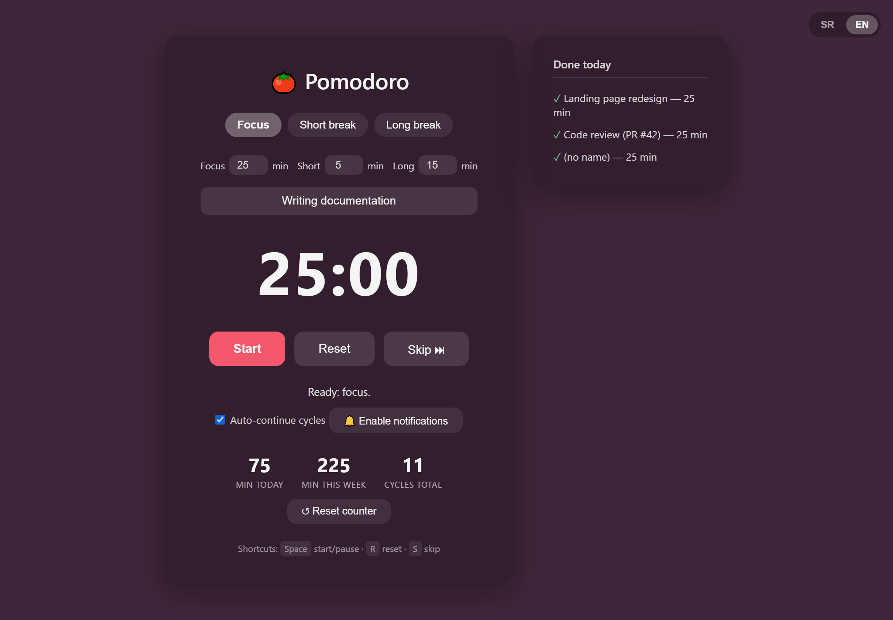
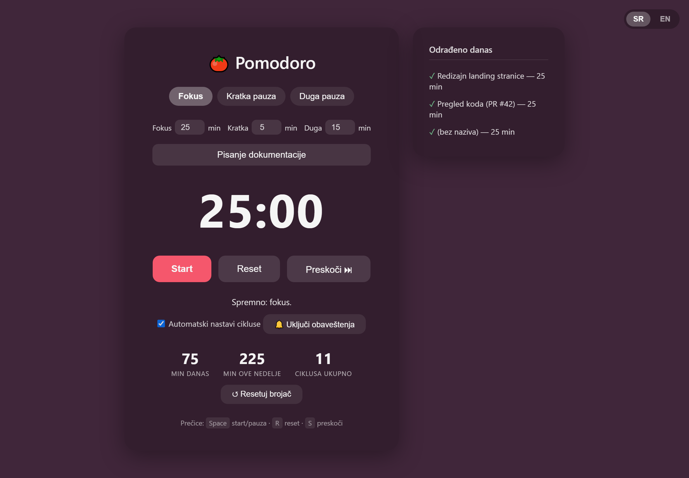

# 🍅 Pomodoro Timer

A clean, lightweight Pomodoro timer built with plain HTML, CSS, and JavaScript — no frameworks, no build step, no dependencies. Just open it in a browser and start focusing.



> **Live demo:** https://anjomozda.github.io/pomodoro-timer/ — available once GitHub Pages is enabled (Settings → Pages → deploy from the `main` branch).

## Features

- **Three modes** — Focus, Short break, and Long break, with automatic long break after every 4 focus sessions.
- **Auto-continue cycles** — the timer chains focus → break → focus on its own (can be turned off).
- **Custom durations** — set your own length for each mode.
- **Session tasks** — note what you're working on; completed tasks are listed in a side panel.
- **Daily statistics** — track focus minutes today, this week, and total completed cycles.
- **Desktop notifications** — get notified when a session ends, even when the tab is in the background.
- **Sound alert** — a subtle chime plays when time is up.
- **Keyboard shortcuts** — `Space` start/pause · `R` reset · `S` skip.
- **Bilingual** — switch between Serbian (SR) and English (EN) from the corner.
- **Persistent** — durations, stats, tasks, and language are saved in `localStorage` and survive a refresh.
- **Responsive** — works on desktop and mobile; the task panel moves below the timer on narrow screens.

The interface is fully bilingual. Here it is in Serbian:



## Usage

Clone or download the repository, then open `index.html` in any modern browser:

```bash
git clone https://github.com/anjomozda/pomodoro-timer.git
cd pomodoro-timer
```

Open `index.html` directly, or serve it locally (recommended so notifications work reliably):

```bash
python -m http.server
```

Then visit `http://localhost:8000`.

## Keyboard shortcuts

| Key     | Action        |
|---------|---------------|
| `Space` | Start / Pause |
| `R`     | Reset         |
| `S`     | Skip          |

## Project structure

```
pomodoro-timer/
├── index.html   # markup
├── style.css    # styles
├── script.js    # timer logic, i18n, storage
├── screenshot.png       # preview (English)
└── screenshot-sr.png    # preview (Serbian)
```

## License

Released under the [MIT License](LICENSE).
